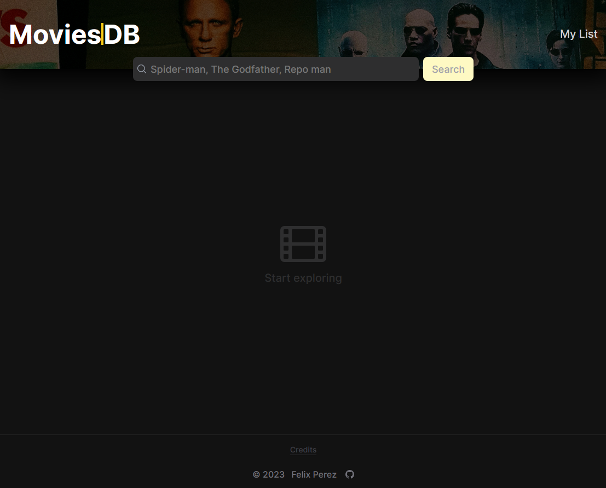
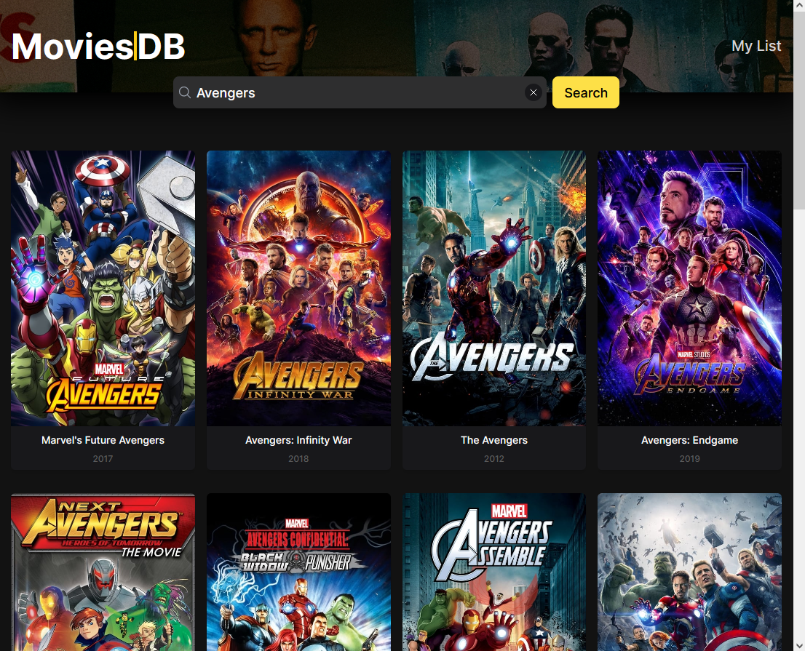
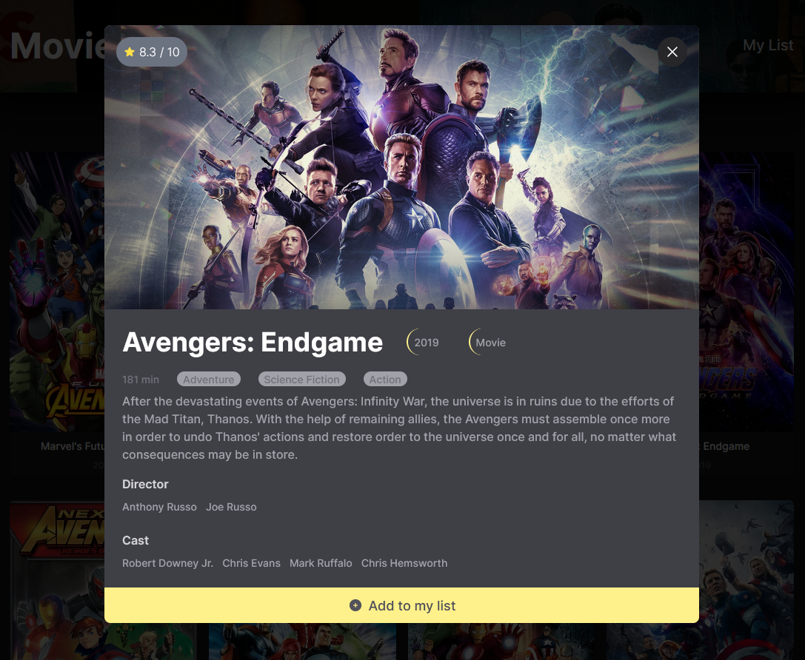
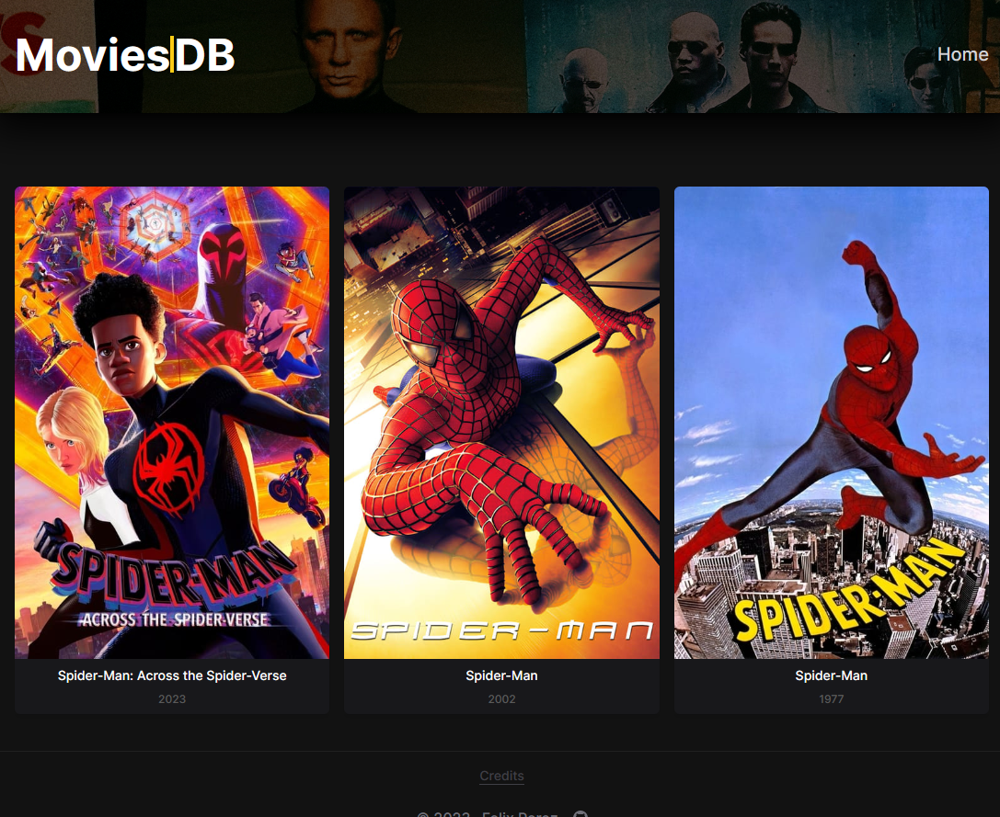

# React Movie Database App

A movie daatabase app built with react, react-router. Users are able to find movies or tv shows by title/name and see detail information about them. Also users can add or remove movies to/from their favorites.

## Live demo

[Netlify link](https://courageous-chaja-7597ca.netlify.app/) (Netlify)

## Screenshots

  
  
  
  

## Built with

- Vite
- React
- React Router
- Tailwind
- Headless UI
- Heroicons
